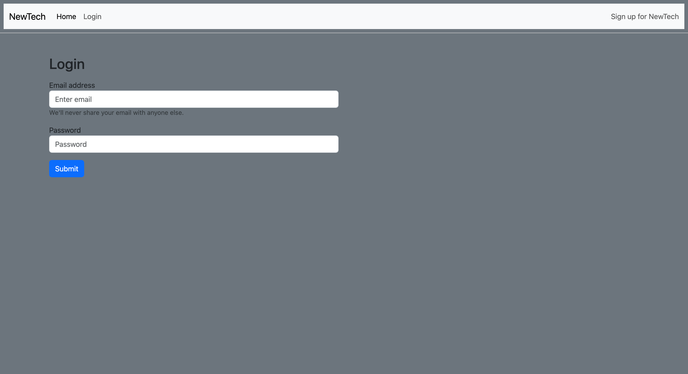
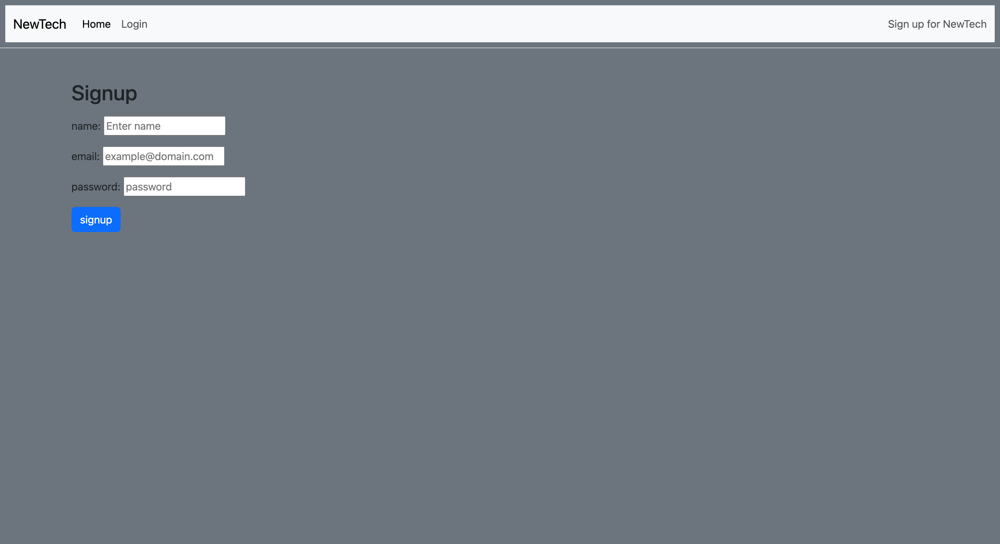
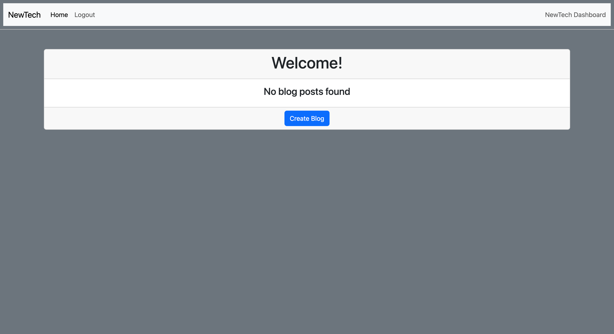
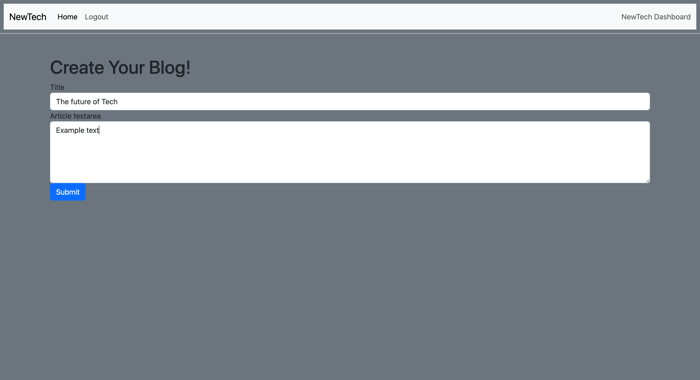
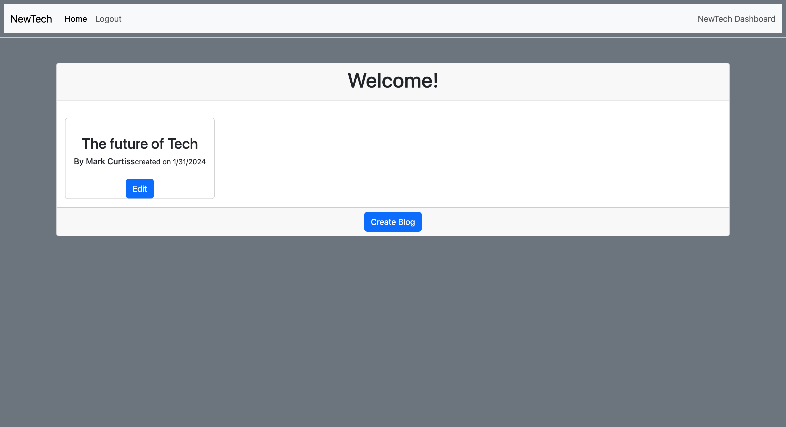
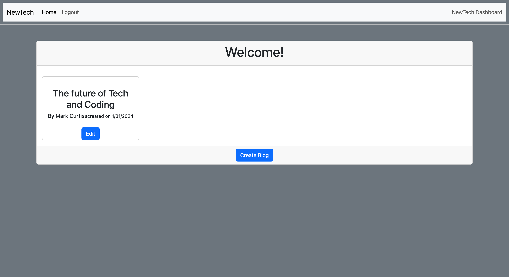
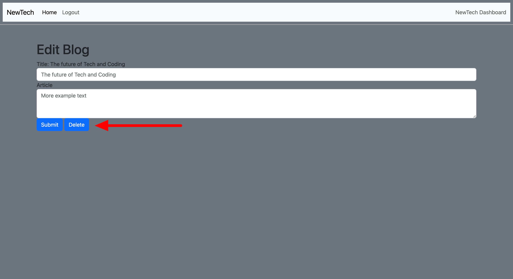
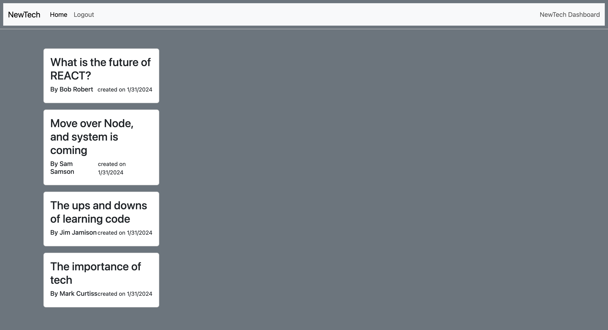
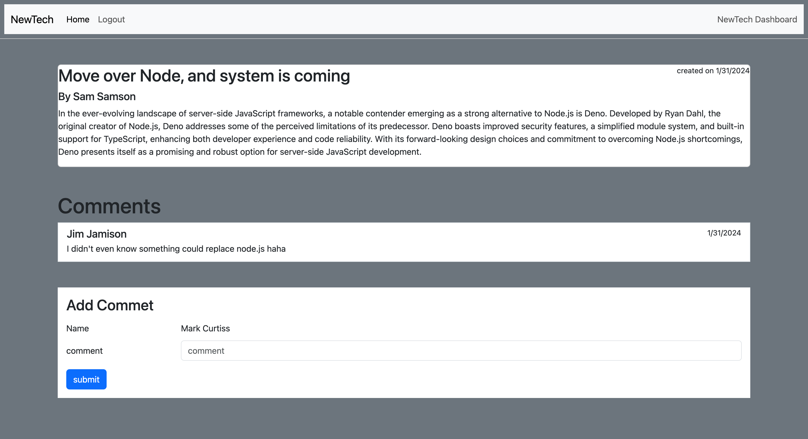

# NewTech-Blog

## Description

A standard blog post application where users can signup/login to create, view, and comment on posts made by others in the tech/coding community

## Table of Contents

- [Installation](#installation)
- [Usage](#usage)
- [Credits](#credits)
- [License](#license)
- [Contributing](#Contributing)
- [Test](#Tests)
- [Questions](#Questions)

## Installation

Clone to repo to you computer and run `npm i` to install the required packages. You will also need to have an undersanding of mysql and how to get into mysql with you rusername and password and how to source the database. `SOURCE db/schema.sql` After which you will need to see the data by running `npm run seed` and then start the sever `npm start`

## Usage

My app is deployed here
https://newtechblogs-869a03be756e.herokuapp.com/login

  When you visit the site you will be prompted to login
  

  Alternatlivly you can sign up by clicking  `Sign up for NewTech` in the top right corner
  

  You then be redirected to your dashbaord. where you can create posts, view all post you have made, edit those posts and even delete them from the site.
  

  

  New post made
  

  

  Updated post
  

  Deleting post
  

  When you click home you are able to view all post made on the site

  

  You can view any post as long as you are logged in, and you can make comments on those posts.
  

    

## Credits

None at this time

## License
    
  

  https://opensource.org/licenses/MIT

## Contributing

If you want to contribute then fork this repo and have at it!

## Tests

None at this time

## Questions

If you have any questions please reach out via email: markcurtiss720@mail.com

or find me on Github: [markcurtiss720@gmail.com](https://github.com/markcurtiss720.com)

